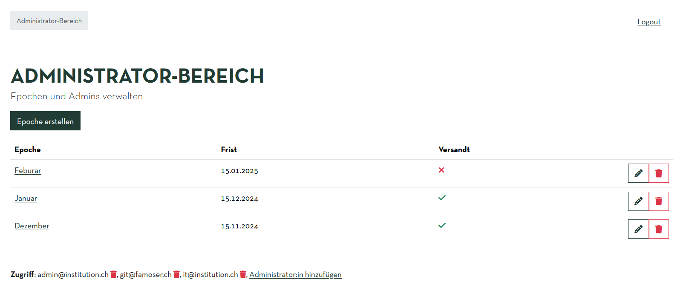
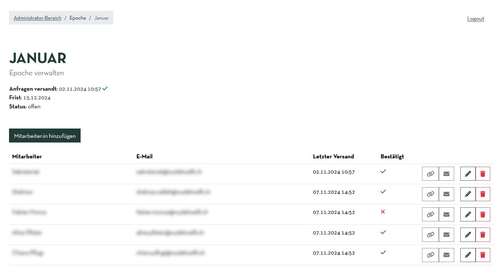
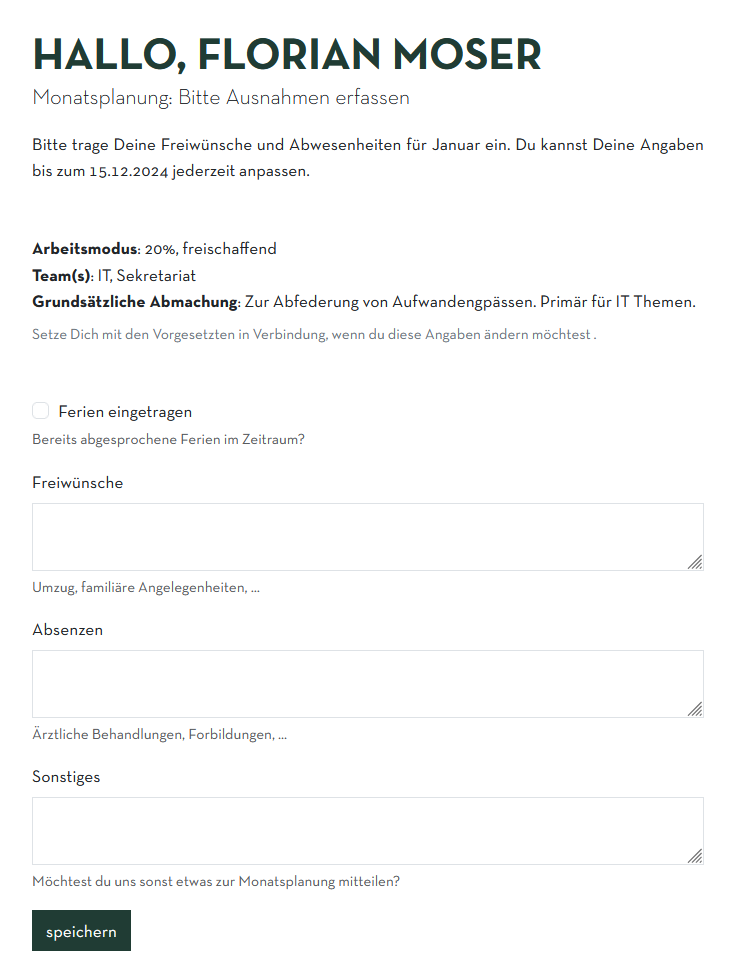

# Mitas

This tool helps a small care institution organize shifts for their employees. Each month, every employee receives an email with a link to declare their requests for the next month (e.g. a free weekend to attend a private event).

## Workflow

Every period, administrators create an era.

Per era, the administrators add employees. Once this is done, the administrators can send an email to all employees to ask for participation until some deadline.

The employee receives the email which contains a special link. Using this link, the employee can enter their requests for the era, using some semi-structured form.

When the deadline of the era closes, the employees can no longer change their requests. The administrator may then download an export of all the received answers.